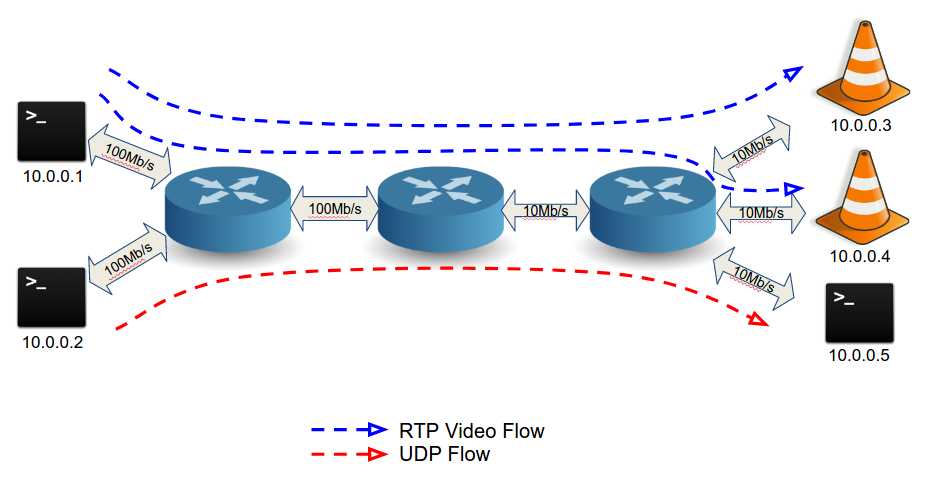

# OpenFlow QoS Proof of Concept

This code provides a emulated network to test Programable Network QoS through OpenFlow 1.3 Queues.

## Instructions

The following instructions are designed to work in an Ubuntu 16.04. It should work in other linux OS with the correct packages installed.

### Requirements

- Modified Mininet Network Emulator. We provide a modified Mininet that allows the use of TCLinks (mininet emulated links with a fixed bandwidth and/or delay) along with virtual switches with queues (openvswitch).
- openvswitch-switch.
- SDN Controller (openvswitch-testcontroller).

### Installation

To install the modified mininet network emulator:

```
cd mininet
./util install -n
``` 

To install openvswitch-switch:

```
sudo apt-get update && sudo apt-get install openvswitch-switch
```

To install SDN Controller:

```
sudo apt-get install openvswitch-testcontroller
```

Stop the SDN controller and disable it on boot. The provided `upgrade_QoS.py` script will manage the controller lifecycle:

```
sudo systemctl stop openvswitch-testcontroller
sudo systemctl disable openvswitch-testcontroller
```

### Running
Mininet is configured to run the following network topology.


We launch the mininet topology with a python script:

```
sudo python upgrade_QoS.py 
```

This command opens three terminals and two vlc clients.


We use the [big buck bunny MP4+H264 FullHD Video](http://distribution.bbb3d.renderfarming.net/video/mp4/bbb_sunflower_1080p_30fps_normal.mp4) in this proof of concept. 

We start the Video Stream emission running in the "RTP Stream Emiter" terminal the following command:

```
./send_video.sh PATH_TO_VIDEO_FILE
```

Both vlc clients (regular and premium user) should start playing the video.

We generate a low priority UDP dataflow that will compete for bandwidth with the regular user (during 300 seconds). We do that by typing in the UDP Noise Sender terminal the command:
 

```
iperf -u -c 10.0.0.5 -b 5M -t 300
```

The regular user will start experimenting quality problems: his video flow shares the output queue of 'core2' switch with the UDP noise dataflow.

We can dynamically reassign the regular user to the high priority queue at core2 switch to improve his quality of experience. We send an OpenFlow rule to do this reassignment.
We open a terminal and execute the set_priority script:


```
./set_priority.sh 10.0.0.1 10.0.0.4 hi
```

We can also decrease the QoE of the premium user with the same script:


```
./set_priority.sh 10.0.0.1 10.0.0.3 lo
```

The last command will make the premium user start experimenting video problems, because we have dynamically reassigned hos video flow to the regular queue.


